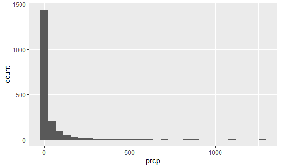
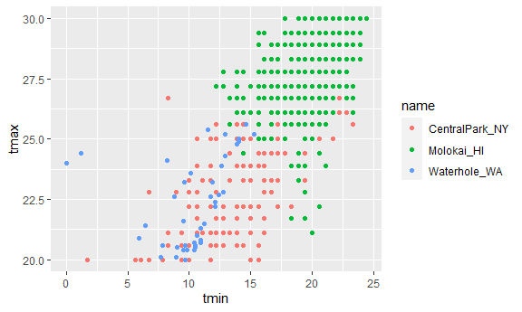
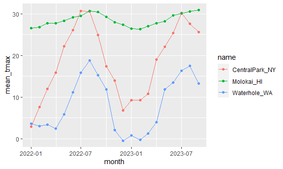

EDA: Numeric Summaries
================
Shaolei Ma
2023-10-05

``` r
weather_df = 
  rnoaa::meteo_pull_monitors( # rnoaa: like an online database
    c("USW00094728", "USW00022534", "USS0023B17S"),
    var = c("PRCP", "TMIN", "TMAX"), 
    date_min = "2022-01-01",
    date_max = "2023-12-31") |>
  mutate(
    name = recode( # case_math / case_when
      id, 
      USW00094728 = "CentralPark_NY", 
      USW00022534 = "Molokai_HI",
      USS0023B17S = "Waterhole_WA"),
    tmin = tmin / 10,
    tmax = tmax / 10,
    month = lubridate::floor_date(date, unit = "month")) |>
  select(name, id, everything())
```

    ## using cached file: C:\Users\administer\AppData\Local/R/cache/R/rnoaa/noaa_ghcnd/USW00094728.dly

    ## date created (size, mb): 2023-09-28 10:20:46.065756 (8.541)

    ## file min/max dates: 1869-01-01 / 2023-09-30

    ## using cached file: C:\Users\administer\AppData\Local/R/cache/R/rnoaa/noaa_ghcnd/USW00022534.dly

    ## date created (size, mb): 2023-09-28 10:21:04.81035 (3.838)

    ## file min/max dates: 1949-10-01 / 2023-09-30

    ## using cached file: C:\Users\administer\AppData\Local/R/cache/R/rnoaa/noaa_ghcnd/USS0023B17S.dly

    ## date created (size, mb): 2023-09-28 10:21:13.137648 (0.996)

    ## file min/max dates: 1999-09-01 / 2023-09-30

## Initial numeric work

``` r
weather_df |> 
  ggplot(aes(x = prcp)) +
  geom_histogram()
```

    ## `stat_bin()` using `bins = 30`. Pick better value with `binwidth`.

    ## Warning: Removed 30 rows containing non-finite values (`stat_bin()`).



here are the big outliers

``` r
weather_df |> 
  filter(tmax >= 20, tmax <= 30) |> 
  ggplot(aes(x = tmin, y = tmax, color = name)) +
  geom_point()
```



## Grouping

``` r
weather_df |> 
  group_by(name, month)
```

    ## # A tibble: 1,914 × 7
    ## # Groups:   name, month [63]
    ##    name           id          date        prcp  tmax  tmin month     
    ##    <chr>          <chr>       <date>     <dbl> <dbl> <dbl> <date>    
    ##  1 CentralPark_NY USW00094728 2022-01-01   201  13.3  10   2022-01-01
    ##  2 CentralPark_NY USW00094728 2022-01-02    10  15     2.8 2022-01-01
    ##  3 CentralPark_NY USW00094728 2022-01-03     0   2.8  -5.5 2022-01-01
    ##  4 CentralPark_NY USW00094728 2022-01-04     0   1.1  -7.1 2022-01-01
    ##  5 CentralPark_NY USW00094728 2022-01-05    58   8.3  -0.5 2022-01-01
    ##  6 CentralPark_NY USW00094728 2022-01-06     0   5     1.1 2022-01-01
    ##  7 CentralPark_NY USW00094728 2022-01-07    97   1.1  -3.8 2022-01-01
    ##  8 CentralPark_NY USW00094728 2022-01-08     0  -1    -6.6 2022-01-01
    ##  9 CentralPark_NY USW00094728 2022-01-09    25   4.4  -1.6 2022-01-01
    ## 10 CentralPark_NY USW00094728 2022-01-10     0   4.4  -4.3 2022-01-01
    ## # ℹ 1,904 more rows

## Counting

``` r
weather_df |> 
  group_by(name, month) |> 
  summarise(n_obs = n())
```

    ## `summarise()` has grouped output by 'name'. You can override using the
    ## `.groups` argument.

    ## # A tibble: 63 × 3
    ## # Groups:   name [3]
    ##    name           month      n_obs
    ##    <chr>          <date>     <int>
    ##  1 CentralPark_NY 2022-01-01    31
    ##  2 CentralPark_NY 2022-02-01    28
    ##  3 CentralPark_NY 2022-03-01    31
    ##  4 CentralPark_NY 2022-04-01    30
    ##  5 CentralPark_NY 2022-05-01    31
    ##  6 CentralPark_NY 2022-06-01    30
    ##  7 CentralPark_NY 2022-07-01    31
    ##  8 CentralPark_NY 2022-08-01    31
    ##  9 CentralPark_NY 2022-09-01    30
    ## 10 CentralPark_NY 2022-10-01    31
    ## # ℹ 53 more rows

``` r
weather_df |> 
  count(name, name = "n_obs")
```

    ## # A tibble: 3 × 2
    ##   name           n_obs
    ##   <chr>          <int>
    ## 1 CentralPark_NY   638
    ## 2 Molokai_HI       638
    ## 3 Waterhole_WA     638

``` r
weather_df |> 
  count(name, month) |> 
  pivot_wider(
    names_from = name,
    values_from = n
  )
```

    ## # A tibble: 21 × 4
    ##    month      CentralPark_NY Molokai_HI Waterhole_WA
    ##    <date>              <int>      <int>        <int>
    ##  1 2022-01-01             31         31           31
    ##  2 2022-02-01             28         28           28
    ##  3 2022-03-01             31         31           31
    ##  4 2022-04-01             30         30           30
    ##  5 2022-05-01             31         31           31
    ##  6 2022-06-01             30         30           30
    ##  7 2022-07-01             31         31           31
    ##  8 2022-08-01             31         31           31
    ##  9 2022-09-01             30         30           30
    ## 10 2022-10-01             31         31           31
    ## # ℹ 11 more rows

## General summaries

``` r
weather_df |> 
  group_by(name, month) |> 
  summarize(
    mean_tmax = mean(tmax, na.rm = T),
    median_tmax = median(tmax, na.rm = T),
    sd_tmax = sd(tmax, na.rm = T)
  )
```

    ## `summarise()` has grouped output by 'name'. You can override using the
    ## `.groups` argument.

    ## # A tibble: 63 × 5
    ## # Groups:   name [3]
    ##    name           month      mean_tmax median_tmax sd_tmax
    ##    <chr>          <date>         <dbl>       <dbl>   <dbl>
    ##  1 CentralPark_NY 2022-01-01      2.85         2.8    5.11
    ##  2 CentralPark_NY 2022-02-01      7.65         7.5    6.79
    ##  3 CentralPark_NY 2022-03-01     12.0         11.1    6.27
    ##  4 CentralPark_NY 2022-04-01     15.8         15.3    4.36
    ##  5 CentralPark_NY 2022-05-01     22.3         22.2    5.24
    ##  6 CentralPark_NY 2022-06-01     26.1         26.1    3.07
    ##  7 CentralPark_NY 2022-07-01     30.7         30      2.24
    ##  8 CentralPark_NY 2022-08-01     30.5         30.6    2.65
    ##  9 CentralPark_NY 2022-09-01     24.9         25      3.94
    ## 10 CentralPark_NY 2022-10-01     17.4         17.2    3.35
    ## # ℹ 53 more rows

``` r
weather_df |> 
  group_by(name, month) |> 
  summarize(mean_tmax = mean(tmax, na.rm = T)) |> 
  ggplot(aes(x = month, y = mean_tmax, color = name)) +
  geom_point() +
  geom_line()
```

    ## `summarise()` has grouped output by 'name'. You can override using the
    ## `.groups` argument.



``` r
weather_df |> 
  group_by(name, month) |> 
  summarize(mean_tmax = mean(tmax, na.rm = T)) |> 
  pivot_wider(
    names_from = name,
    values_from = mean_tmax
  ) |> 
  knitr::kable(digits = 2)
```

    ## `summarise()` has grouped output by 'name'. You can override using the
    ## `.groups` argument.

| month      | CentralPark_NY | Molokai_HI | Waterhole_WA |
|:-----------|---------------:|-----------:|-------------:|
| 2022-01-01 |           2.85 |      26.61 |         3.61 |
| 2022-02-01 |           7.65 |      26.83 |         2.99 |
| 2022-03-01 |          11.99 |      27.73 |         3.42 |
| 2022-04-01 |          15.81 |      27.72 |         2.46 |
| 2022-05-01 |          22.25 |      28.28 |         5.81 |
| 2022-06-01 |          26.09 |      29.16 |        11.13 |
| 2022-07-01 |          30.72 |      29.53 |        15.86 |
| 2022-08-01 |          30.50 |      30.70 |        18.83 |
| 2022-09-01 |          24.92 |      30.41 |        15.21 |
| 2022-10-01 |          17.43 |      29.22 |        11.88 |
| 2022-11-01 |          14.02 |      27.96 |         2.14 |
| 2022-12-01 |           6.76 |      27.35 |        -0.46 |
| 2023-01-01 |           9.29 |      26.41 |         0.74 |
| 2023-02-01 |           9.21 |      26.37 |        -0.23 |
| 2023-03-01 |          10.83 |      27.00 |         1.24 |
| 2023-04-01 |          19.03 |      27.72 |         3.97 |
| 2023-05-01 |          22.10 |      28.17 |        11.89 |
| 2023-06-01 |          25.42 |      29.66 |        13.50 |
| 2023-07-01 |          30.20 |      30.05 |        16.34 |
| 2023-08-01 |          27.62 |      30.60 |        17.50 |
| 2023-09-01 |          25.62 |      30.89 |        13.29 |
