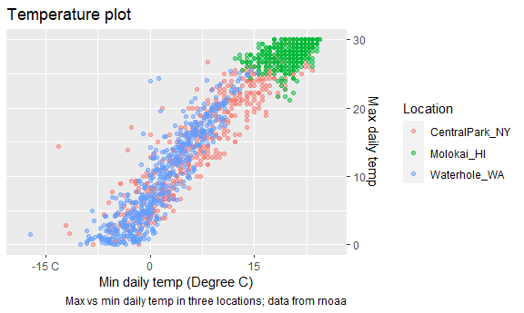
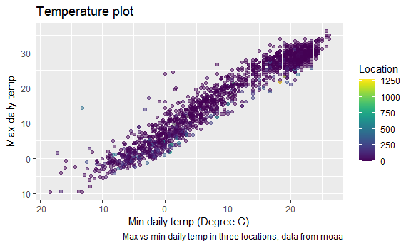
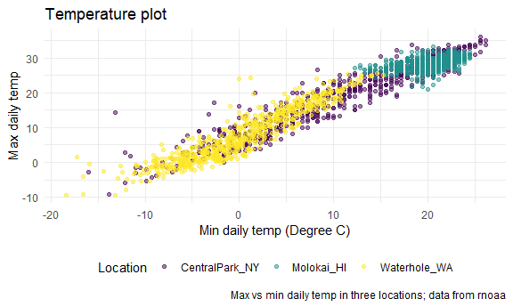
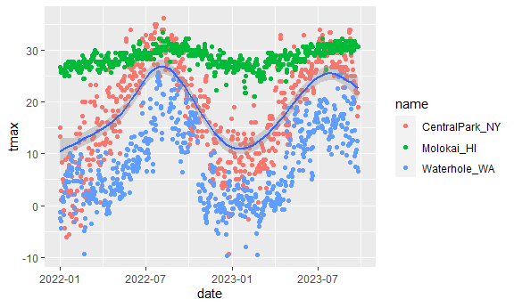
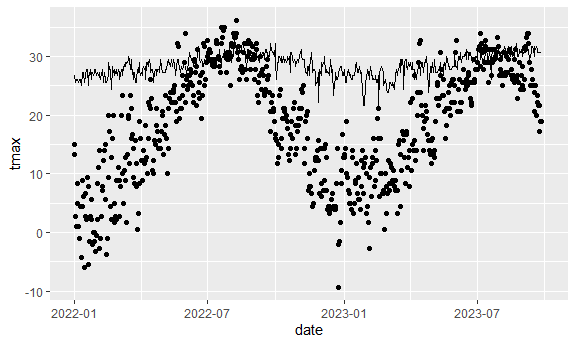
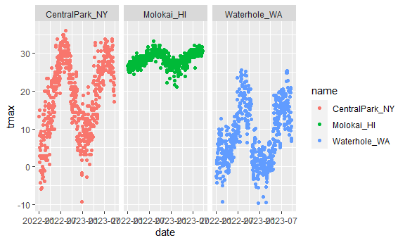
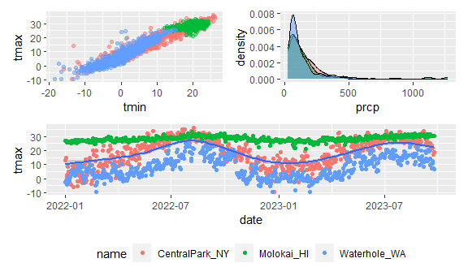
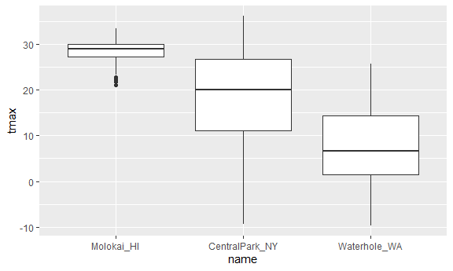
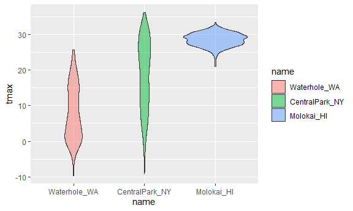

Viz part 1
================
Shaolei Ma
2023-10-03

``` r
weather_df = 
  rnoaa::meteo_pull_monitors( # rnoaa: like an online database
    c("USW00094728", "USW00022534", "USS0023B17S"),
    var = c("PRCP", "TMIN", "TMAX"), 
    date_min = "2022-01-01",
    date_max = "2023-12-31") |>
  mutate(
    name = recode( # case_math / case_when
      id, 
      USW00094728 = "CentralPark_NY", 
      USW00022534 = "Molokai_HI",
      USS0023B17S = "Waterhole_WA"),
    tmin = tmin / 10,
    tmax = tmax / 10) |>
  select(name, id, everything())
```

    ## using cached file: C:\Users\administer\AppData\Local/R/cache/R/rnoaa/noaa_ghcnd/USW00094728.dly

    ## date created (size, mb): 2023-09-28 10:20:46.065756 (8.541)

    ## file min/max dates: 1869-01-01 / 2023-09-30

    ## using cached file: C:\Users\administer\AppData\Local/R/cache/R/rnoaa/noaa_ghcnd/USW00022534.dly

    ## date created (size, mb): 2023-09-28 10:21:04.81035 (3.838)

    ## file min/max dates: 1949-10-01 / 2023-09-30

    ## using cached file: C:\Users\administer\AppData\Local/R/cache/R/rnoaa/noaa_ghcnd/USS0023B17S.dly

    ## date created (size, mb): 2023-09-28 10:21:13.137648 (0.996)

    ## file min/max dates: 1999-09-01 / 2023-09-30

This results in variables in a dataframe with 1914 observations and six
variables.

## Same plot from last time

``` r
weather_df |> 
  # filter(tmin > 10) |> 
  ggplot(aes(x = tmin, y = tmax, color = name)) + 
  geom_point(alpha = .5) +
  labs(
    title = "Temperature plot",
    x = "Min daily temp (Degree C)",
    y = "Max daily temp",
    color = "Location",
    caption = "Max vs min daily temp in three locations; data from rnoaa"
  ) +
  scale_x_continuous(
    breaks = c(-15, 0, 15),
    labels = c("-15 C", "0", "15")
  ) +
  scale_y_continuous(
    position = "right",
    # trans = "sqrt" # sqrt transformation
    limits = c(0, 30) # does not affect the range of x axis
  )
```

    ## Warning: Removed 322 rows containing missing values (`geom_point()`).



## Colors

``` r
weather_df |>
  ggplot(aes(x = tmin, y = tmax, color = prcp)) + 
  geom_point(alpha = .5) +
  labs(
    title = "Temperature plot",
    x = "Min daily temp (Degree C)",
    y = "Max daily temp",
    color = "Location",
    caption = "Max vs min daily temp in three locations; data from rnoaa"
  ) +
  viridis::scale_color_viridis( # encouraged to use
    # discrete = T # not applied for continuous variables
    )
```

    ## Warning: Removed 30 rows containing missing values (`geom_point()`).



## Themes

``` r
weather_df |>
  ggplot(aes(x = tmin, y = tmax, color = name)) + 
  geom_point(alpha = .5) +
  labs(
    title = "Temperature plot",
    x = "Min daily temp (Degree C)",
    y = "Max daily temp",
    color = "Location",
    caption = "Max vs min daily temp in three locations; data from rnoaa"
  ) +
  viridis::scale_color_viridis( # encouraged to use
    discrete = T # not applied for continuous variables
    ) +
  # theme_bw() + # put theme_bw before theme
  theme_minimal() +
  theme(legend.position = "bottom")
```

    ## Warning: Removed 30 rows containing missing values (`geom_point()`).



## data argument …

``` r
weather_df |> 
  ggplot(aes(x = date, y = tmax)) +
  geom_point(aes(color = name)) +
  geom_smooth()
```

    ## `geom_smooth()` using method = 'gam' and formula = 'y ~ s(x, bs = "cs")'

    ## Warning: Removed 30 rows containing non-finite values (`stat_smooth()`).

    ## Warning: Removed 30 rows containing missing values (`geom_point()`).



``` r
nyc_weather_df = 
  weather_df |> 
  filter(name == "CentralPark_NY")

hawaii_weather_df = 
  weather_df |> 
  filter(name == "Molokai_HI")

ggplot(nyc_weather_df, aes(x = date, y = tmax)) +
  geom_point() +
  geom_line(data = hawaii_weather_df)
```

    ## Warning: Removed 5 rows containing missing values (`geom_point()`).

    ## Warning: Removed 5 rows containing missing values (`geom_line()`).



## `patchwork`

``` r
weather_df |> 
  ggplot(aes(x = date, y = tmax, color = name)) +
  geom_point() +
  facet_grid(. ~ name)
```

    ## Warning: Removed 30 rows containing missing values (`geom_point()`).



``` r
ggp_temp_scatter = 
  weather_df |> 
  ggplot(aes(x = tmin, y = tmax, color = name)) +
  geom_point(alpha = .5) + 
  theme(legend.position = "none")

ggp_prcp_density = 
  weather_df |> 
  filter(prcp > 25) |> 
  ggplot(aes(x = prcp, fill = name)) +
  geom_density(alpha = .5) + 
  theme(legend.position = "none")

ggp_tmax_date = 
  weather_df |> 
  ggplot(aes(x = date, y = tmax)) +
  geom_point(aes(color = name)) +
  geom_smooth() +
  theme(legend.position = "bottom")

# library(patchwork)
(ggp_temp_scatter + ggp_prcp_density) / ggp_tmax_date
```

    ## Warning: Removed 30 rows containing missing values (`geom_point()`).

    ## `geom_smooth()` using method = 'gam' and formula = 'y ~ s(x, bs = "cs")'

    ## Warning: Removed 30 rows containing non-finite values (`stat_smooth()`).
    ## Removed 30 rows containing missing values (`geom_point()`).



## data manipulation

``` r
weather_df |> 
  mutate( # change the order from default
    name = fct_relevel(name, c("Molokai_HI", "CentralPark_NY", "Waterhole_WA"))
  ) |> 
  ggplot(aes(x = name, y = tmax)) +
  geom_boxplot()
```

    ## Warning: Removed 30 rows containing non-finite values (`stat_boxplot()`).



``` r
weather_df |> 
  mutate( # change the order according to the median of another variable
    name = fct_reorder(name, tmax)
  ) |> 
  ggplot(aes(x = name, y = tmax, fill = name)) +
  geom_violin(alpha = .5)
```

    ## Warning: There was 1 warning in `mutate()`.
    ## ℹ In argument: `name = fct_reorder(name, tmax)`.
    ## Caused by warning:
    ## ! `fct_reorder()` removing 30 missing values.
    ## ℹ Use `.na_rm = TRUE` to silence this message.
    ## ℹ Use `.na_rm = FALSE` to preserve NAs.

    ## Warning: Removed 30 rows containing non-finite values (`stat_ydensity()`).



## complicate FAS plot

``` r
litters_df = 
  read_csv("data/FAS_litters.csv") |> 
  janitor::clean_names() |>
  separate(group, into = c("dose", "day_of_tx"), sep = 3)
```

    ## Rows: 49 Columns: 8
    ## ── Column specification ────────────────────────────────────────────────────────
    ## Delimiter: ","
    ## chr (2): Group, Litter Number
    ## dbl (6): GD0 weight, GD18 weight, GD of Birth, Pups born alive, Pups dead @ ...
    ## 
    ## ℹ Use `spec()` to retrieve the full column specification for this data.
    ## ℹ Specify the column types or set `show_col_types = FALSE` to quiet this message.

``` r
pups_df = 
  read_csv("data/FAS_pups.csv") |> 
  janitor::clean_names()
```

    ## Rows: 313 Columns: 6
    ## ── Column specification ────────────────────────────────────────────────────────
    ## Delimiter: ","
    ## chr (1): Litter Number
    ## dbl (5): Sex, PD ears, PD eyes, PD pivot, PD walk
    ## 
    ## ℹ Use `spec()` to retrieve the full column specification for this data.
    ## ℹ Specify the column types or set `show_col_types = FALSE` to quiet this message.

``` r
fas_df = 
  left_join(pups_df, litters_df, by = "litter_number")
  
fas_df |> 
  select(dose, day_of_tx, starts_with("pd")) |> 
  pivot_longer(
    pd_ears:pd_walk,
    names_to = "outcome",
    values_to = "pn_day"
  ) |> 
  drop_na() |> 
  mutate(
    outcome = fct_reorder(outcome, pn_day)
  ) |> 
  ggplot(aes(x = dose, y = pn_day)) +
  geom_violin() +
  facet_grid(day_of_tx ~ outcome)
```


